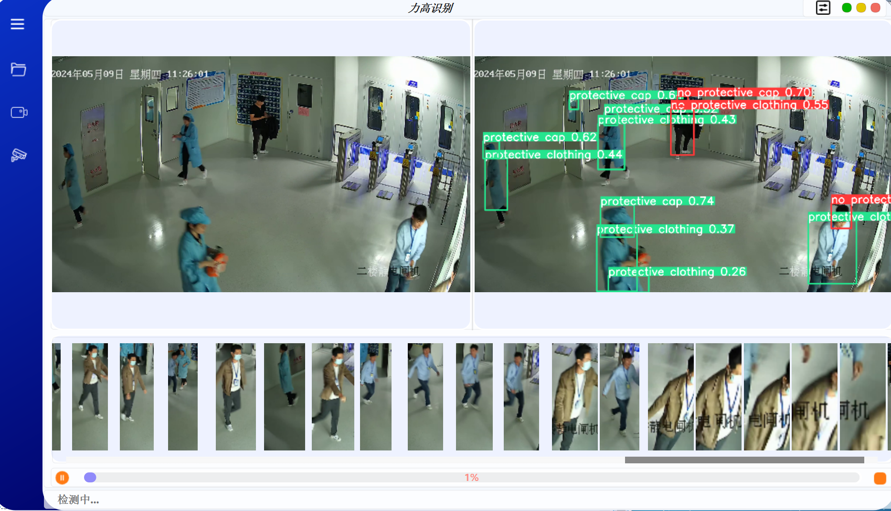

# ligao-detection

该系统专注于识别工业环境中工作人员是否正确佩戴个人防护装备，包括防护帽和防护服。通过实时视频分析，系统能够精准识别并标记出未按规定着装的个体，从而确保作业环境的安全合规性。

## 功能

1. 检测工作人员是否佩戴防护服防护帽

2. 将未佩戴防护工具的人员截取出来
3. 可以自由选择模型
4. 可以修改IoU阈值和置信度阈值

## 页面效果

## 如何使用
- `python>=3.8`
- `pip install ultralytics==8.1.0` or `git clone --branch v8.1.0 --single-branch https://github.com/ultralytics/ultralytics.git`
- `pip install pyside6 chardet`
- `pip install torch==1.12.1+cu113 torchvision==0.13.1+cu113 torchaudio==0.12.1 --extra-index-url https://download.pytorch.org/whl/cu113`
- `python main.py`

## References

- [ultralytics](https://github.com/ultralytics/ultralytics)
- [Ultralytics-PySide6](https://github.com/WangQvQ/Ultralytics-PySide6)
